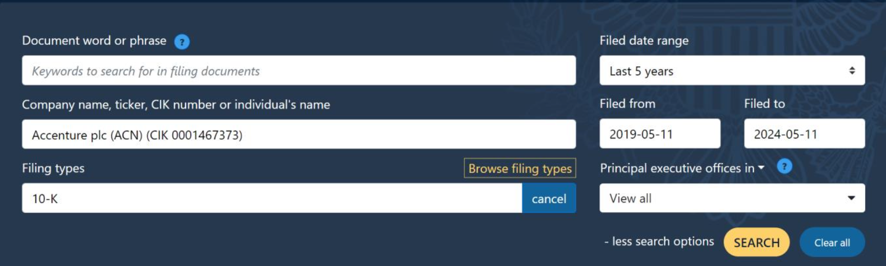
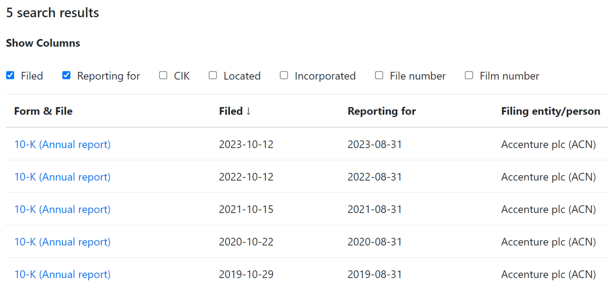
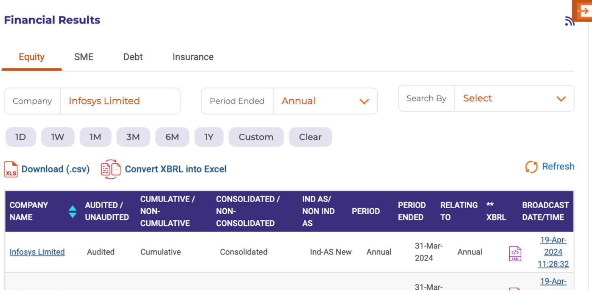
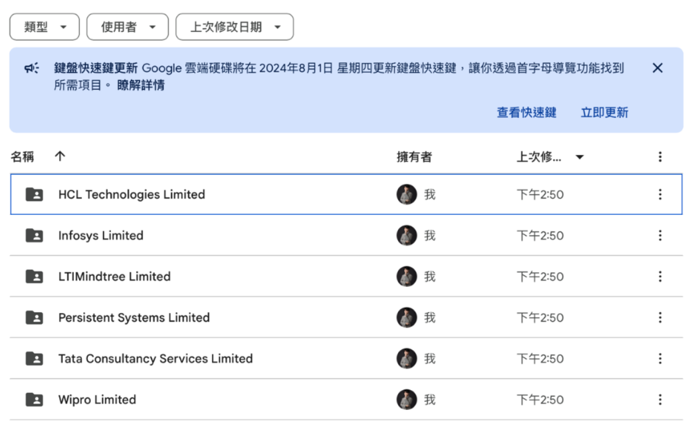
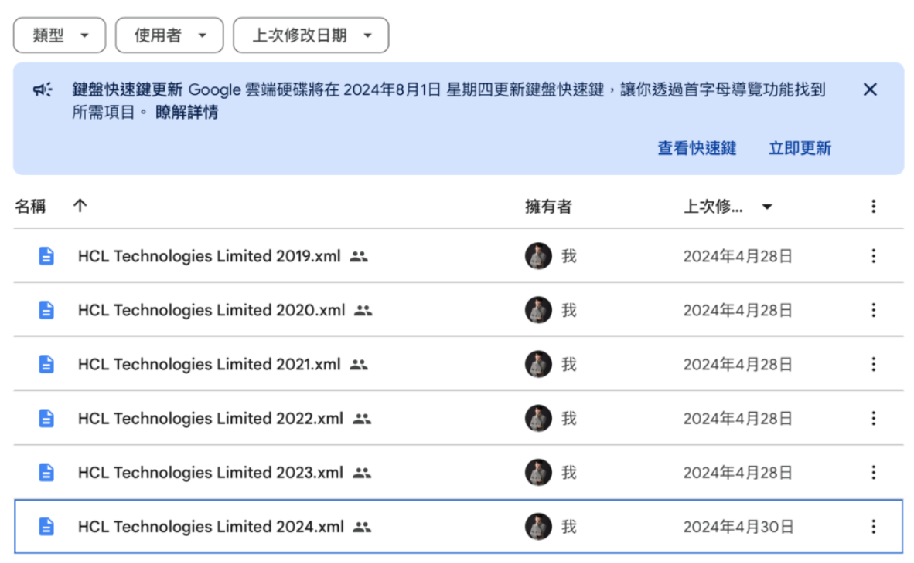
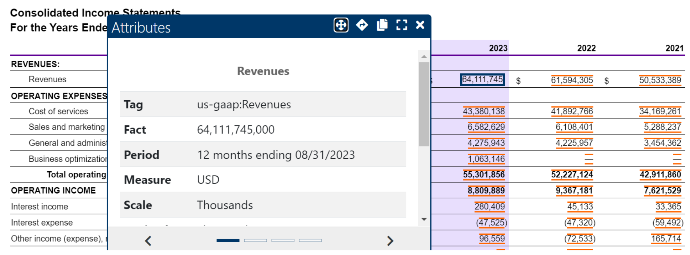
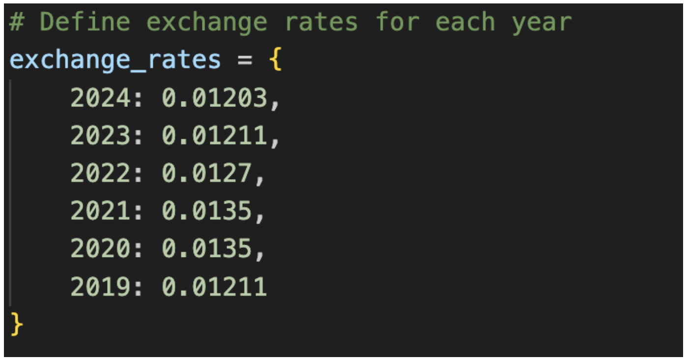

# Project: Financial Data Processing for US and Indian Companies

## 資料夾架構

```
Data
├── final_data
│   └── finalized.py
├── processed_data
│   └── 資料串接.py
├── raw_data
│   ├── India_rawdata.py
│   ├── US_rawdata.py
│   ├── 自動化下載及解壓縮.py
│   └── XML_data
└── setup
    ├── 公司基本資料.xlsx
    ├── 會計科目表.xlsx
    └── 財務指標公式.xlsx
```

## 檔案說明

### 1. Setup Files (設定檔案)

這些檔案包含新增目標公司及定義財務框架所需的基本信息。

#### a. 公司基本資料 (company_basic_info.xlsx)

**結構:**

| company (full name)                           | StartMonth | country | ServiceType  |
|-----------------------------------------------|------------|---------|--------------|
| COGNIZANT TECHNOLOGY SOLUTIONS CORP           | 1          | US      | IT Services  |

**補充說明:** 公司名稱須和資料源相符。

#### b. 會計科目表 (account_mapping.xlsx)

**結構:**

| Target_Account | 公司A會計科目名稱             | 公司B會計科目名稱             |
|----------------|-------------------------------|-------------------------------|
| Revenue        | A公司使用的Revenue科目名稱    | B公司使用的Revenue科目名稱    |

**補充說明:** 公司名稱須和公司基本資料相符。

#### c. 財務指標公式 (financial_metrics_formula.xlsx)

**結構:**

| Description             | Formula                                 |
|-------------------------|-----------------------------------------|
| NI_Margin_Ratio         | (NetIncomeLoss / Revenues) * 100        |

**補充說明:** formula的會計項目名稱需參照會計科目表欲抓取的會計項目。

## 操作方式說明

### 1. 新增分析標的 (Adding a New Target Company)

#### a. US Company (美國公司)

1. **Find the company on EDGAR:**
   - 以新增 US 國家為例，假設要新增的是 Accenture
   - 公司名稱:以 EDGAR 搜尋 Accenture 後，以搜尋欄的公司全稱 Accenture plc 為主，並且全 為大寫。

   [EDGAR Search](https://www.sec.gov/edgar/search/)
    

2. **Determine the fiscal year start month:**
   - 會計年度起始月份:點擊Browsefilingtypes，將格式設定為10-K，接著往下滑看Reporting for 欄，這欄代表會計結束年度，若結束於 8/31，則會計年度起始月份便是 9。
  
    

#### b. Indian Company (印度公司)

1. **Find the company on NSE:**
   - 搜尋公司（例如：Infosys Limited）。
   - 選擇"Annual"（年報）作為Period Ended。
   - 搜尋欄中的公司名稱須完全一致（例如：Infosys Limited）。

   [NSE Corporate Filings](https://www.nseindia.com/companies-listing/corporate-filings-financial-results)
    

3. **Determine the fiscal year start month:**
   - 會計年度起始月份:可以從PeriodEnded欄位中可以得知，範例Infosys公司的會計起始月份是四月

4. **Download the financial reports:**
   - 請依據需要的會計年度，右鍵點選圖中 XBRL 欄位的檔案，將連結檔案下載下來，檔名請 取做Company Name_Year，舉圖中公司為例，下載的檔名需叫做:Infosys Limited_2024.xml，使用者在操作時需注意下載的是合併報表(Consolidated)，而非 Non-Consolidated

5. **Organize the XML data:**
   - 下載完所有檔案後，請將檔案歸檔成一個大資料夾，名稱需取作XML_data，XML_data資 料夾當中，請依照印度公司的完整公司名，為每一間公司創建一個資料夾，在各公司的資 料夾當中才會是依照 Company Name_Year 的 XML 檔案，範例如下:

   
    

### 2. 新增會計科目表 (Add Account Mapping)

1. **Find and add the company's account names:**
   - 以新增公司 column 為例，假設要新增的是 Accenture，進入年報的財務報表，從報表上找 尋會計項目，例如 Revenues，點擊項目的數字會出現會計項目的 Attribute，其中的 Tag 便是 Accenture 在 Revenues 上使用的會計科目名稱，將其新增到會計科目欄位。
   
    

### 3. 產出 rawdata (Generate Raw Data)

#### a. US Company (美國公司)

1. **Run `自動化下載及解壓縮.py`**:
   - 執行「自動化下載及解壓縮.py」，會在當前路徑產出 rawdata 資料夾，資料夾裡有所有資 料源 num、sub。

2. **Run `US_rawdata.py`**:
   - 執行「US_rawdata.py」，產出 US_rawdata.csv

#### b. Indian Company (印度公司)

1. **Run `India_rawdata.py`**:
   - 產生`India_rawdata.csv`。

2. **Check exchange rates in `India_rawdata.py`**:
   - 確認所有會計年度的匯率資料是否存在。
   - 新增缺少的匯率資料（例如：`2025: 匯率數字`）。

    

### 4. 產出 Processed_data (Generate Processed Data)

1. **Run `資料串接.py`**:
   - 執行「資料串接.py」，會在資料夾「processed_data」裡產出 processed_data.csv，此檔案包含各間公司科目一致化且轉換會計年度後的 Financial Metrics。

### 5. 產出 Final_data (Generate Final Data)

1. **Run `Finalized.py`**:
   - 執行「finalized.py」，產出 Final_data.csv，並將 Final_data 輸入進 PowerBI。
